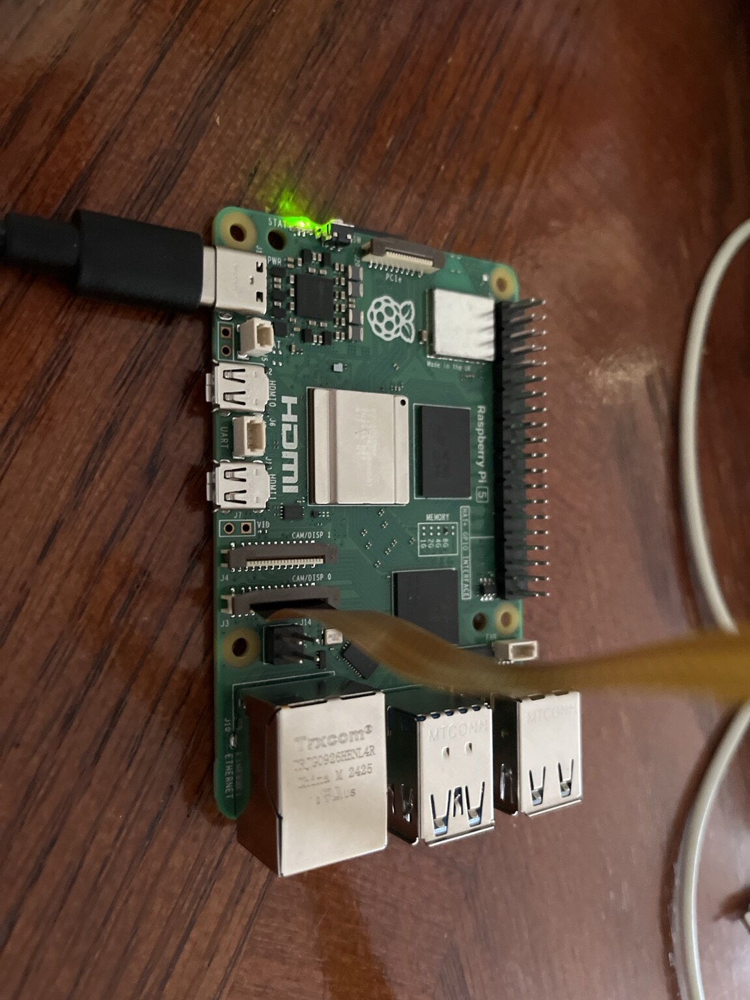
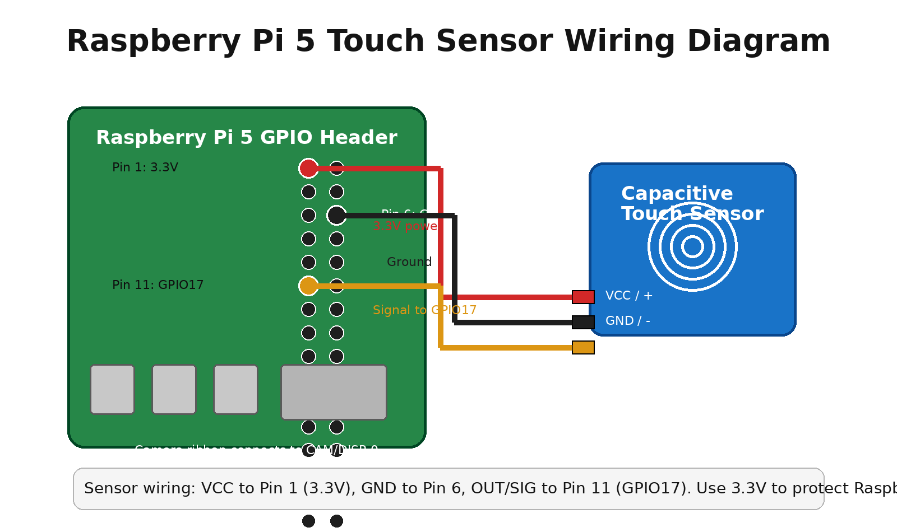
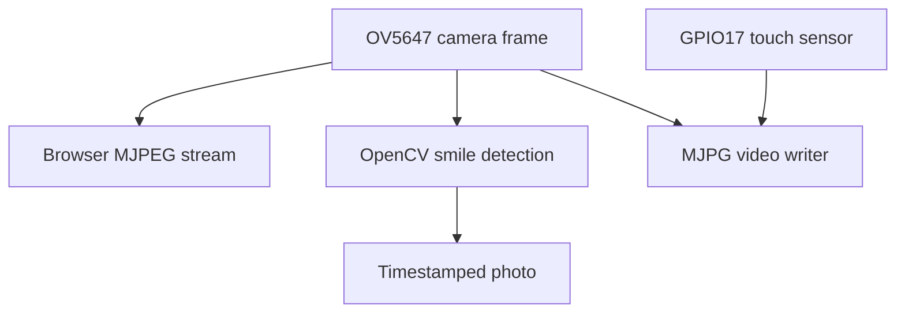

<div align="center">
  

  # Smart Smile & Touch Camera

  **A Raspberry Pi 5 camera that captures smiles, records on touch, and streams to a browser.**

  
  
  
  
</div>

## Features

- a live video feed in a web browser;
- automatic smile-triggered photos;
- touch-sensor-controlled video recording; and
- download links for the latest photo and video.



## How it works

The program uses one continuous camera loop for three jobs:

1. It converts each frame to JPEG and streams it through a Flask webpage.
2. It checks faces for smiles with OpenCV Haar cascades. After a smile is detected, it saves a timestamped JPG.
3. While recording is enabled, it writes the frames to a timestamped MJPG AVI file.

Touching the capacitive sensor toggles recording:

- first touch: start recording;
- second touch: stop and save the video.

The browser interface displays the current event, recording state, latest filenames, and download links.



## Hardware

- Raspberry Pi 5
- OV5647 5 MP CSI camera
- 22-pin-to-15-pin Raspberry Pi 5 camera cable
- Capacitive touch sensor
- Three jumper wires
- Ethernet cable, if using a direct connection to a computer

### Touch-sensor wiring

| Sensor pin | Raspberry Pi connection | Purpose |
| --- | --- | --- |
| VCC / `+` | Physical pin 1 (`3.3V`) | Powers the sensor safely |
| GND / `-` | Physical pin 6 (`GND`) | Ground |
| OUT / SIG | Physical pin 11 (`GPIO17`) | Recording toggle signal |

Use 3.3 V for the sensor. Raspberry Pi GPIO pins are not 5 V tolerant.

The OV5647 camera connects to the Raspberry Pi 5 `CAM/DISP 0` connector.

## Software installation

The project was built on Raspberry Pi OS Lite. Install the required packages:

```bash
sudo apt update
sudo apt install -y \
  python3-picamera2 \
  python3-opencv \
  opencv-data \
  python3-gpiozero \
  python3-flask
```

Enable the OV5647 camera by adding these lines to `/boot/firmware/config.txt`:

```ini
[all]
camera_auto_detect=0
dtoverlay=ov5647,cam0
```

Then reboot and verify that the camera is detected:

```bash
sudo reboot
rpicam-hello --list-cameras
```

## Run the project

Clone the repository and start the program:

```bash
git clone https://github.com/jonathannerd/smart-smile-touch-camera.git
cd smart-smile-touch-camera
python3 smileTouchCamera.py
```

The program saves files in:

```text
/home/pi/smileTouchProject/photos
/home/pi/smileTouchProject/videos
```

Open the Pi's port `5000` in a browser. In the original direct-Ethernet setup, the address was:

```text
http://192.168.2.2:5000
```

If your Pi has a different IP address, use that address instead.

## Browser controls

The webpage provides:

- the continuous live camera stream;
- the latest event message;
- the current recording state;
- the latest saved photo and video filenames;
- **Download Latest Photo**; and
- **Download Latest Video**.

## Project structure

```text
.
├── README.md
├── camera-config.txt
├── docs
│   ├── ov5647-camera.jpg
│   ├── raspberry-pi-5.jpg
│   └── wiring-diagram.png
├── requirements-apt.txt
└── smileTouchCamera.py
```

## Troubleshooting

### Camera is not detected

- Check both ends of the ribbon cable and replace it if it is damaged.
- Confirm that the camera is connected to `CAM/DISP 0`.
- Confirm the `dtoverlay=ov5647,cam0` setting.
- Run `rpicam-hello --list-cameras`.

### OpenCV cannot load the cascade files

Install `opencv-data` and confirm these files exist:

```text
/usr/share/opencv4/haarcascades/haarcascade_frontalface_default.xml
/usr/share/opencv4/haarcascades/haarcascade_smile.xml
```

### Touch sensor does not respond

- Confirm that OUT is connected to GPIO17, physical pin 11.
- Confirm that VCC is connected to 3.3 V and GND to ground.
- The program intentionally uses `pull_up=True`.

### Browser cannot connect

- Confirm that the computer and Raspberry Pi are on the same local network.
- Confirm the Pi's current IP address with `hostname -I`.
- Open `http://<pi-ip-address>:5000`.

### AVI file does not play

The video uses the MJPG codec in an AVI container. VLC can play this format, or it can be converted with FFmpeg.

## Known limitations

- Haar-cascade smile detection is less reliable in low light, at an angle, or when the image is out of focus.
- The program detects a smile-like pattern; it does not identify the person.
- Photos and videos are stored locally rather than uploaded automatically.
- The browser must be able to reach the Raspberry Pi over the local network.
